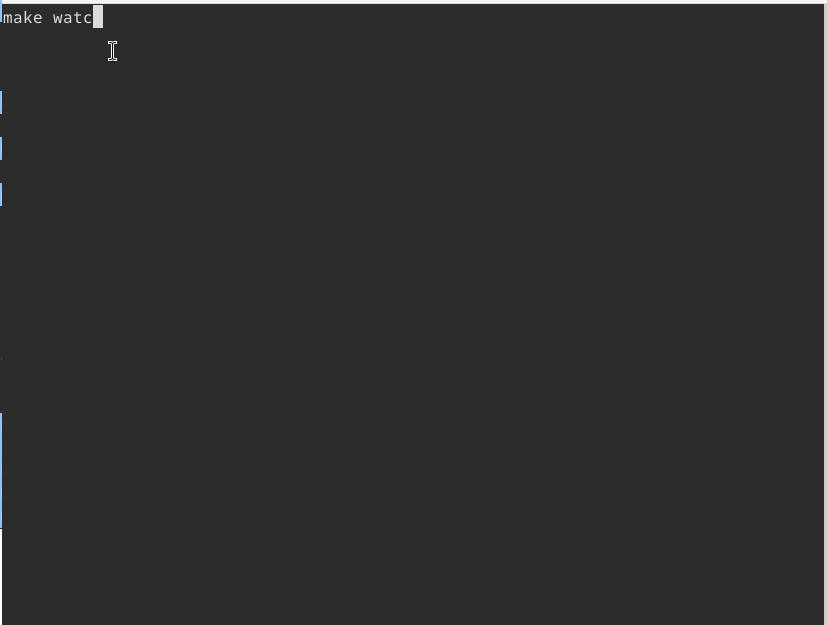

# BAD APPLE as a boot disk

Bad Apple!! rendered as ASCII frames, played directly from a bootable disk, no OS, no filesystem, no drivers. Just BIOS, x86, and vibes.

## Demo!
<div align="center">

</div>

##  How it works?
- MBR bootloader (16-bit real mode)
    - Loaded at 0x7C00
    - Uses BIOS INT 13h to load the kernel
    - Switches to protected mode
- Minimal kernel (32-bit)
    - Runs at a fixed physical address
    - Writes directly to 0xB8000 (VGA text mode)
    - Decodes and displays ASCII frames
- Custom RLE-based ASCII art compression

## Install the dependancies and run
Based on my fedora install, I had to install some additional dependencies
```
sudo dnf install stb_image-devel ffmpeg yt-dlp nasm gcc ld make qemu
```

Once installed, you should be able to watch the video with:
```
make watch
```

and run it with qemu using:
```
make run
```

You also can clean things with the classical `make clean` and/or `make clean-all`.

Of course you can also play with parameters in the Makefile and recompile stuff :)

## Limitations
- Unable to run the full video (yet)
- Real hardware not guaranteed (yet)
- Depends on BIOS disk behavior
- No keyboard handling
- No graceful exit ;) This is a demo, not an OS.

## Next step
- Currently the rendered video is limited to about 3000 frames, the limitation is due to the compressed frames hitting an upper address limit. The addresses layout is:
```
- 0x00000-0x07BFF: reserved
- 0x07C00-0x07DFF: mbr
- 0x07E00-0x08000: stack for mbr
- 0x08000-0x8FFFF: kernel + compressed frame
- 0x90000 and upper: unusable
```
  Our kernel currently has a length of 1940 bytes, leaving 585,835 bytes for compressed images. The complete video contains 6572 images at 30 frames per second, which gives 80*24*6572=12,618,240 bytes, which is too large...
  The naive RLE compression algorithm reduces the size to 1,093,952 bytes (a ratio of approximately 8.7%, the size is between tar.gz and tar.bz2), which is still too large, leaving us with only about 3,200 images available.

- I also need to rework the FPS calibration in the kernel, as it's a complete dumb thing so far.
